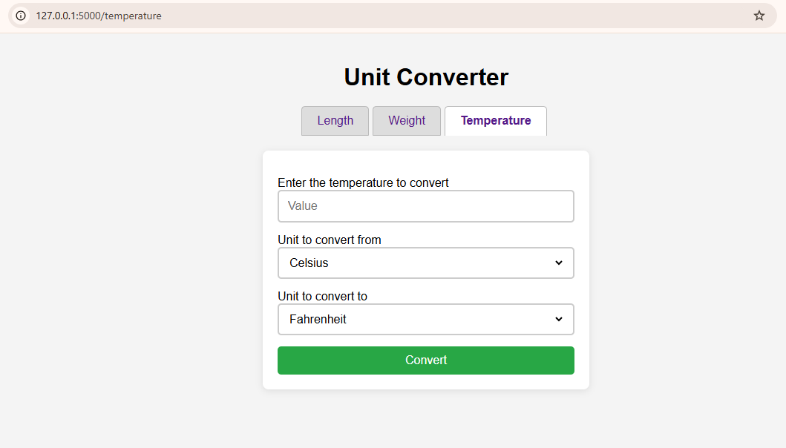

# Unit Converter App

A simple and intuitive unit converter application built with Flask. This app allows users to convert between various units of length, weight, and temperature.

## Features

- **Length Conversion**: Convert between units such as meters, kilometers, feet, inches, and more.
- **Weight Conversion**: Convert between grams, kilograms, pounds, ounces, and other weight units.
- **Temperature Conversion**: Convert between Celsius, Fahrenheit, and Kelvin.
- **Responsive Design**: Works well on both desktop and mobile devices.

## Technologies Used

- **Backend**: Flask
- **Frontend**: HTML, CSS, JavaScript
- **Styling**: CSS

## Installation

### Prerequisites

- Python 3.x
- Flask

### Steps

1. Clone the repository:

   ```bash
   git clone https://github.com/yourusername/unit-converter.git
   cd unit-converter
   ```

2. Create a virtual environment:

   ```bash
   python -m venv venv
   ```

3. Activate the virtual environment:

   - On Windows:

     ```bash
     venv\Scripts\activate
     ```

   - On macOS/Linux:

     ```bash
     source venv/bin/activate
     ```

4. Install the required packages:

   ```bash
   pip install Flask
   ```

5. Run the application:

   ```bash
   python app.py
   ```

6. Open your web browser and navigate to `http://127.0.0.1:5000/`.

## Usage

1. Select the type of conversion you want to perform (Length, Weight, or Temperature).
2. Enter the value you wish to convert.
3. Choose the units you are converting from and to.
4. Click "Convert" to see the result.
5. Use the tabs to switch between different conversion types.

## Screenshots




## Contributing
Contributions are welcome! If you have suggestions for improvements or want to add features, please fork the repository and submit a pull request.

**Repository Link**:
`https://github.com/sulaimonwasiu/unit-converter.git`

